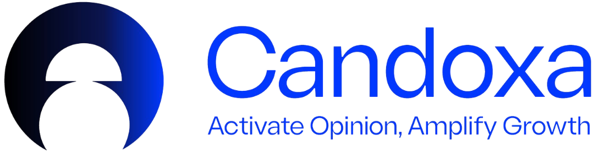

<div align="center">
  
</div>

# Candoxa DApp

  - [1. Project Description](#1-project-description)
  - [2. Features](#2-features)
  - [3. Technologies Used](#3-technologies-used)
  - [4. Prerequisites](#4-prerequisites)
    - [4.1. Node.js](#41-nodejs)
    - [4.2. TypeScript](#42-typescript)
  - [5. Installation](#5-installation)
    - [5.1. Clone the Repository](#51-clone-the-repository)
    - [5.2. Access the Project Directory](#52-access-the-project-directory)
    - [5.3. Install Dependencies](#53-install-dependencies)
  - [6. Execution](#6-execution)
    - [6.1. Configure Environment Variables](#61-configure-environment-variables)
    - [6.2. Start the Application](#62-start-the-application)
    - [6.3. Candoxa DApp Interface](#63-candoxa-dapp-interface)
    - [6.4. Network Configuration](#64-network-configuration)
    - [6.5. Base Sepolia Testnet Explorer](#65-base-sepolia-testnet-explorer)

## 1. Project Description
Candoxa is a Web3 platform where creators collect their best work from across the internet into one public, permanent profile. Content and reputation are recorded on-chain, so they remain verifiable beyond platforms and algorithms. Discovery is driven by the community, not by opaque feeds or pay-to-play systems. Even if accounts disappear, your work and credibility stay intact.

## 2. Features
* **MetaMask Integration:** allows users to connect their MetaMask wallet to interact with Candoxa and sign blockchain transactions;
* **Link Registration:** users can register and publish links to the blockchain, creating a permanent, verifiable record of their work;
* **Global Feed:** displays all links registered on the platform by all users, enabling content discovery across the community;
* **Personal Profile:** users can view their own profile with all links they've registered, along with reputation metrics and statistics;
* **Public Profile Viewing:** allows viewing any user's public profile by their wallet address, showing their registered links and reputation;
* **On-Chain Storage:** all links and user data are permanently stored on the Base Sepolia blockchain, ensuring persistence and verifiability;
* **Automatic Network Switching:** seamlessly adds and switches to Base Sepolia Testnet when connecting your wallet;

*Note: more features will be introduced as development continues*

## 3. Technologies Used
* **Next.js:** React framework for building scalable, server-rendered web applications;
* **TypeScript:** strongly typed superset of JavaScript that improves code safety and maintainability;
* **Tailwind CSS:** CSS framework that enables styling directly in markup using predefined utility classes;
* **Shadcn UI:** Design system focused on full ownership and customization of components;
* **Solidity:** programming language for writing immutable smart contracts that define on-chain business logic and state on Ethereum;
* **Wagmi:** React hooks library for interacting with Ethereum wallets and smart contracts;

## 4. Prerequisites
### 4.1. Node.js
> Download and Install [Node.js](https://nodejs.org/)

### 4.2. TypeScript
   ```sh
   npm install -g typescript
   ```

## 5. Installation
### 5.1. Clone the Repository
```sh
git clone https://github.com/Join-Candoxa/candoxa-dapp.git
```

### 5.2. Access the Project Directory
```sh
cd candoxa-dapp
```

### 5.3. Install Dependencies
```sh
pnpm install
```

## 6. Execution
### 6.1. Configure Environment Variables
1. Rename the **.env.example** file located at the root of the project to **.env.local**
2. **Configure WalletConnect Project ID (REQUIRED for mobile):**
   - Go to https://cloud.walletconnect.com/
   - Sign up or login
   - Create a new project
   - Copy your Project ID
   - Paste it in `.env.local`: `NEXT_PUBLIC_WALLETCONNECT_PROJECT_ID="your_project_id_here"`
3. The contract address is already configured for Base Sepolia Testnet

**Note:** Without a WalletConnect Project ID, the app will NOT work on mobile devices!

### 6.2. Start the Application
```sh
pnpm dev
```

### 6.3. Connecting Your Wallet
**On Desktop:**
- Click "Connect with MetaMask" button
- Approve the connection in your MetaMask extension

**On Mobile (iPhone/Android):**
- **Option 1 (Recommended):** Open the app URL directly in the MetaMask mobile browser
- **Option 2:** Open in any browser (Safari/Chrome), click "Connect with MetaMask", and it will open WalletConnect modal
- **Note:** Make sure you have configured the WalletConnect Project ID in `.env.local`

### 6.3. Candoxa DApp Interface
* The Candoxa DApp UI can be accessed at **http://localhost:3000/**

### 6.4. Network Configuration
The application is configured to work on **Base Sepolia Testnet**. When you connect your wallet, the application will automatically request to add/switch to this network with the following configuration:
* **Network Name:** Base Sepolia Testnet
* **RPC URL:** https://sepolia.base.org
* **Chain ID:** 84532 (0x14a34)
* **Currency Symbol:** ETH
* **Block Explorer:** https://sepolia.basescan.org
* **Contract Address:** 0xaCc207b98375e93cff68B6a0a9ED18b369F1E559

### 6.5. Base Sepolia Testnet Explorer
* Transaction validation can be performed through **https://sepolia.basescan.org/**
* You can get testnet ETH from the Base Sepolia faucet at **https://www.alchemy.com/faucets/base-sepolia** (requires Alchemy account)
